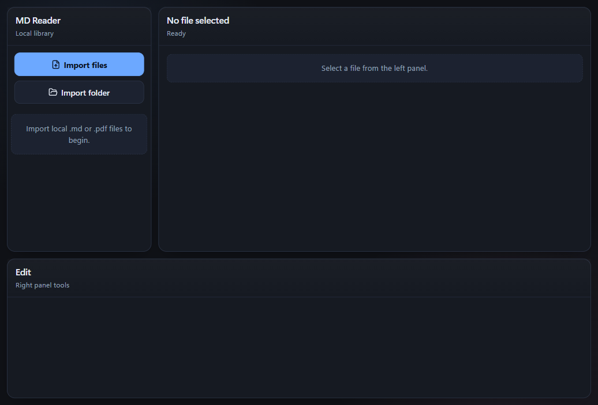

# Northstar

Local-first **Markdown** and **PDF** reader for Windows (web + **Tauri** desktop). Import files into a private library, read and annotate PDFs, edit Markdown, and export when you need a file on disk.

## Best for other PC

- Run `Northstar_0.1.0_x64-setup.exe` (or `.msi`) from the release artifacts.
- This is the one-step flow and handles prerequisites better than copying only an `.exe`.
- Portable mode is supported, but keep the full folder (`md-readeder.exe` + `resources/`) together.

### Which option is best?

1. **Best for most users:** NSIS setup `.exe` (`Northstar_0.1.0_x64-setup.exe`)
2. **Best for IT/admin deployment:** MSI (`Northstar_0.1.0_x64_en-US.msi`)
3. **Use only when needed:** Portable folder (`md-readeder.exe` + `resources/`)

### File locations

- NSIS installer (`.exe`): `src-tauri/target/release/bundle/nsis/Northstar_0.1.0_x64-setup.exe`
- MSI installer (`.msi`): `src-tauri/target/release/bundle/msi/Northstar_0.1.0_x64_en-US.msi`
- Release app executable (`.exe`): `src-tauri/target/release/md-readeder.exe`
- Portable executable copy (`.exe`): `output/portable/Northstar-Portable/md-readeder.exe`

## Screenshot

## Quick links

- **[Install and use](docs/INSTALL-AND-USE.md)** — Windows installers, portable folder, WebView2, troubleshooting  
- **[GitHub / release checklist](docs/GITHUB-READINESS.md)** — what to commit, releases, risks  

## Scripts

| Command | Purpose |
|---------|---------|
| `npm install` | Install dependencies |
| `npm run dev` | Vite dev server (browser) |
| `npm run tauri:dev` | Desktop app + dev server |
| `npm run build` | Production `dist/` |
| `npm run tauri:build` | Desktop installers + exe |
| `npm run tauri:build:exe` | Release exe only (`--no-bundle`) |
| `npm run lint` | ESLint |

**Prerequisites (desktop):** Node.js, Rust + `cargo` on `PATH`, Microsoft Edge WebView2 Runtime (or let the app/bootstrapper install it).

## License

See `src-tauri/Cargo.toml` (MIT) and project `package.json` for npm package metadata.
